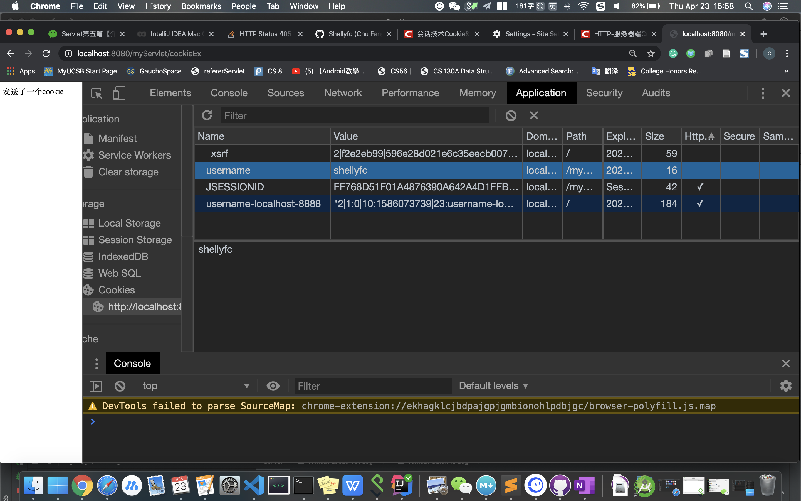

# Cookie

- 网页之间的交互是通过HTTP协议传输数据的，而Http协议是无状态的协议。无状态的协议是什么意思呢？一旦数据提交完后，浏览器和服务器的连接就会关闭，再次交互的时候需要重新建立新的连接。

- 服务器无法确认用户的信息，于是乎，W3C就提出了：给每一个用户都发一个通行证，无论谁访问的时候都需要携带通行证，这样服务器就可以从通行证上确认用户的信息。通行证就是Cookie

- Cookie的流程：浏览器访问服务器，如果服务器需要记录该用户的状态，就使用response向浏览器发送一个Cookie，浏览器会把Cookie保存起来。当浏览器再次访问服务器的时候，浏览器会把请求的网址连同Cookie一同交给服务器。

## Cookie API
Cookie类用于创建一个Cookie对象

response接口中定义了一个addCookie方法，它用于在其响应头中增加一个相应的Set-Cookie头字段

request接口中定义了一个getCookies方法，它用于获取客户端提交的Cookie

## 常用的Cookie方法：

public Cookie(String name,String value)

setValue与getValue方法

setMaxAge与getMaxAge方法

setPath与getPath方法

setDomain与getDomain方法

getName方法

cookie.setMaxAge(10*60);

## Cookie的有效期
Cookie的有效期是通过setMaxAge()来设置的。

- 如果MaxAge为正数，浏览器会把Cookie写到硬盘中，只要还在MaxAge秒之前，登陆网站时该Cookie就有效【不论关闭了浏览器还是电脑】

- 如果MaxAge为负数，Cookie是临时性的，仅在本浏览器内有效，关闭浏览器Cookie就失效了，Cookie不会写到硬盘中。Cookie默认值就是-1。这也就为什么在我第一个例子中，如果我没设置Cookie的有效期，在硬盘中就找不到对应的文件。

- 如果MaxAge为0，则表示删除该Cookie。Cookie机制没有提供删除Cookie对应的方法，把MaxAge设置为0等同于删除Cookie

```
import javax.servlet.ServletException;
import javax.servlet.annotation.WebServlet;
import javax.servlet.http.Cookie;
import javax.servlet.http.HttpServlet;
import javax.servlet.http.HttpServletRequest;
import javax.servlet.http.HttpServletResponse;
import java.io.IOException;

@WebServlet("/cookieEx")
public class CookieEx extends HttpServlet {


    @Override
    protected void doGet(HttpServletRequest req, HttpServletResponse resp) throws ServletException, IOException {
        resp.setContentType("text/html;charset=UTF-8");

        Cookie cookie = new Cookie("username","shellyfc");

        cookie.setMaxAge(1000);

        resp.addCookie(cookie);


        resp.getWriter().write("发送了一个cookie");
    }
}
```


chrome-inspect-application-cookies


### 中文的存储


	String name = "中文的value";
	
	Cookie cookie = new Cookie("info", URLEncoder.encode(name, "UTF-8"));
	
	Cookie[] cookies = req.getCookies(); //会获得所有的cookies
        for( int i = 0; cookies != null && i < cookies.length; i++){
            String name = cookies[i].getName();

            String value2 = URLDecoder.decode(cookies[i].getValue(),"UTF-8");

            resp.getWriter().write(name + " " + value2);
        }
        
### Cookie的路径

	cookie.setPath("/myServlet/MyServlet");
	
只有设置的路径才能获取cookie，删除cookie时，path必须一致，否则不会删除。


## Cookie应用
### 显示用户上次访问的时间
先检查（遍历）所有Cookie有没有我要的，如果得不到我想要的Cookie，Cookie的值是null，那么就是第一次登陆。

	import javax.servlet.ServletException;
	import javax.servlet.annotation.WebServlet;
	import javax.servlet.http.Cookie;
	import javax.servlet.http.HttpServlet;
	import javax.servlet.http.HttpServletRequest;
	import javax.servlet.http.HttpServletResponse;
	import java.io.IOException;
	import java.io.PrintWriter;
	import java.text.SimpleDateFormat;
	import java.util.Date;
	
	@WebServlet("/cookieLastLogin")
	public class CookieLastLogin extends HttpServlet {
	
	    @Override
	    protected void doGet(HttpServletRequest req, HttpServletResponse resp) throws ServletException, IOException {
	        SimpleDateFormat simpleDateFormat = new SimpleDateFormat("yyyy-MM-dd HH:mm:ss");
	        resp.setContentType("text/html;charset=UTF-8");
	        PrintWriter printWriter = resp.getWriter();
	
	
	        Cookie[] cookies = req.getCookies();
	
	        String cookieValue = null;
	        for ( int i = 0; cookies != null && i < cookies.length; i++){
	            if ( cookies[i].getName().equals("time")){
	                printWriter.write("您上次登录的时间是： ");
	                cookieValue = cookies[i].getValue();
	                printWriter.write(cookieValue);
	
	                cookies[i].setValue(simpleDateFormat.format(new Date()));
	                resp.addCookie(cookies[i]);
	
	                break;
	            }
	        }
	
	        if(cookieValue == null ){
	            Cookie cookie = new Cookie("time", simpleDateFormat.format(new Date()));
	            cookie.setMaxAge(20000);
	            resp.addCookie(cookie);
	            printWriter.write("您是第一次登录");
	        }
	    }
	}


### 显示上次浏览过商品

	//ServletA.java
	
	import java.io.IOException;
	import java.io.PrintWriter;
	import java.util.LinkedHashMap;
	import java.util.Map;
	import java.util.Set;
	
	import javax.servlet.ServletException;
	import javax.servlet.annotation.WebServlet;
	import javax.servlet.http.Cookie;
	import javax.servlet.http.HttpServlet;
	import javax.servlet.http.HttpServletRequest;
	import javax.servlet.http.HttpServletResponse;
	
	//代表书店首页的Servlet
	@WebServlet("/ServletA")
	public class ServletA extends HttpServlet {
	    private static final long serialVersionUID = 1L;
	
	    protected void doGet(HttpServletRequest request,
	                         HttpServletResponse response) throws ServletException, IOException {
	
	        response.setCharacterEncoding("UTF-8");
	        response.setContentType("text/html;charset=UTF-8");
	        PrintWriter out = response.getWriter();
	
	        // 1. 输出网站的所有书籍
	        out.write("本网站有如下书籍：<br/>");
	        Map<String, Book> map = DB.getAll();
	        Set<Map.Entry<String, Book>> set = map.entrySet();
	        for (Map.Entry<String, Book> entry : set) {
	            Book book = entry.getValue();
	            // 这儿的超链接打开方式设为在新的窗口打开
	            // 并且需要将每次所浏览书的id给ServletB
	            out.print("<a href='/myServlet/ServletB?id=" + book.getId()
	                    + "' target='_blank'>" + book.getName() + "</a>");
	            out.write("<br/>");
	        }
	
	        // 4. 从浏览器带来的Cookie中，得到用户曾经看过的书籍
	        out.print("<br/><br/>您曾经浏览过的书籍:<br/>");
	        Cookie[] cookies = request.getCookies();
	        for (int i = 0; cookies != null && i < cookies.length; i++) {
	            if (cookies[i].getName().equals("bookHistory")) {
	                String[] ids = cookies[i].getValue().split(",");// 得到浏览过所有书籍的id集合{2,3,1}
	                for (String id : ids) {
	                    Book book = DB.getAll().get(id);
	                    out.print(book.getName() + "<br/>");
	                }
	            }
	        }
	
	    }
	
	    protected void doPost(HttpServletRequest request,
	                          HttpServletResponse response) throws ServletException, IOException {
	        doGet(request, response);
	    }
	
	}
	
	class DB {
	
	    // 使用LinkedHashMap是为了保证存储和取出的顺序一致
	    private static Map<String, Book> map = new LinkedHashMap<String, Book>();
	
	    static {
	
	        map.put("1", new Book("1", "javaweb开发", "老张", "一本好书"));
	        map.put("2", new Book("2", "spring开发", "老黎", "一本好书"));
	        map.put("3", new Book("3", "hibernate开发", "老佟", "一本好书"));
	        map.put("4", new Book("4", "struts开发", "老毕", "一本好书"));
	        map.put("5", new Book("5", "ajax开发", "老张", "一本好书"));
	
	    }
	
	    public static Map<String, Book> getAll() {
	        return map;
	    }
	
	}


	
```
//ServletB

import java.io.IOException;
import java.io.PrintWriter;
import java.util.Arrays;
import java.util.LinkedList;
import java.util.List;

import javax.servlet.ServletException;
import javax.servlet.annotation.WebServlet;
import javax.servlet.http.Cookie;
import javax.servlet.http.HttpServlet;
import javax.servlet.http.HttpServletRequest;
import javax.servlet.http.HttpServletResponse;

//显示商品详细信息的Servlet
@WebServlet("/ServletB")
public class ServletB extends HttpServlet {
    private static final long serialVersionUID = 1L;

    protected void doGet(HttpServletRequest request,
                         HttpServletResponse response) throws ServletException, IOException {

        response.setCharacterEncoding("UTF-8");
        response.setContentType("text/html;charset=UTF-8");
        PrintWriter out = response.getWriter();

        // 2. 根据用户带过来的id，显示商品的详细信息
        String id = request.getParameter("id");
        Book book = DB.getAll().get(id);

        out.write("您要查看的书的详细信息如下：<br/><br/>");
        out.print("书名：" + book.getName() + "<br/>");
        out.print("作者：" + book.getAuthor() + "<br/>");
        out.print("描述：" + book.getDescription() + "<br/>");

        // 3. 构建Cookie，回写给浏览器
        // 根据当前浏览书籍的id和本次request中包含的bookHistory来构建一个新的bookHistory
        String cookieValue = buildCookie(id, request,response);
        response.getWriter().write(cookieValue);
        Cookie cookie = new Cookie("bookHistory", cookieValue);

        cookie.setMaxAge(30 * 24 * 3600);
        cookie.setPath("/myServlet/"); //注意要ServletA和ServletB都能或得cookies
        response.addCookie(cookie);

    }

    private String buildCookie(String id, HttpServletRequest request, HttpServletResponse response) throws IOException {

        // bookHistory=null 1 bookHistory=1
        // bookHistory=3_1_5 1 bookHistory=1_3_5
        // bookHistory=3_2_5 1 bookHistory=1_3_2
        // bookHistory=3_2 1 bookHistory=1_3_2

        String bookHistory = null;
        Cookie[] cookies = request.getCookies();

        // 从浏览器带来的cookie中得到bookHistory，并将其赋值给本地变量bookHistory
        for (int i = 0; cookies != null && i < cookies.length; i++) {
            if (cookies[i].getName().equals("bookHistory")) {
                bookHistory = cookies[i].getValue();
            }
        }

        // ①如果bookHistory=null，说明浏览器之前并没有访问过本网站的书籍，所以返回当前浏览的书籍的id
        if (bookHistory == null) {
            response.getWriter().write("奇了怪了");
            return id;
        }

        // bookHistory字符串中包含的是之前浏览书籍的所有id，且以“，”分开
        // 所以可以将其切分成一个数组
        response.getWriter().write(bookHistory);
        String[] srcArray = bookHistory.split(",");
        // 将数组转成List集合
        List<String> srcList = Arrays.asList(srcArray);
        // 查看asList方法的源码，知道该方法返回的其实是一个ArrayList
        // 由于LinkedList集合的增删快，所以可以将ArrayList集合转成LinkedList
        LinkedList<String> list = new LinkedList<>();
        list.addAll(srcList);
        response.getWriter().write(list.toString());

        // ②如果bookHistory中包含当前浏览书籍的id，那么就将当前浏览书籍的id放在最前面
        if (list.contains(id)) {
            list.remove(id);
            list.addFirst(id);
        } else {
            // ③如果bookHistory中包含的书籍id大于等于3，则需要移去最后的id，并将当前浏览书籍的id放在最前面
            if (list.size() >= 3) {
                list.removeLast();
                list.addFirst(id);

            } else {
                // ④bookHistory包含的书籍id小于3，且不含当前浏览书籍的id，则直接将当前浏览书籍的id加入到最前面
                list.addFirst(id);
                response.getWriter().write(list.toString());
            }
        }

        StringBuffer sb = new StringBuffer();
        for (String l : list) {
            response.getWriter().write(l);
            sb.append(l).append(",");
        }

        // 去掉左后一个无用的逗号
        return sb.deleteCharAt(sb.length() - 1).toString();
    }

    protected void doPost(HttpServletRequest request,
                          HttpServletResponse response) throws ServletException, IOException {
        doGet(request, response);
    }

}
```


