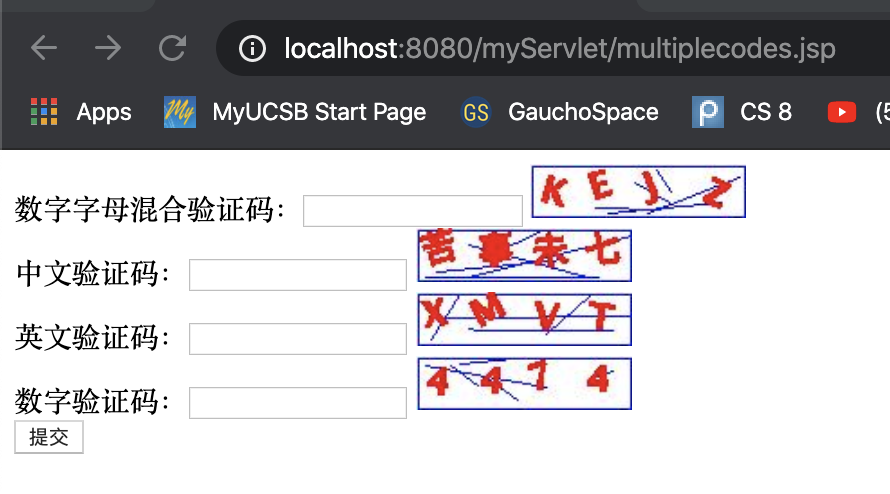

#JAVA 学习
##1. JAVA基础
###流程控制
###面向对象的概念
###Java语法
###this指针、重写和重载、final、static等等这些基础的东西
###集合(包括泛型)
###常用的集合类
###IO流
###IO流代码的编写  
##2. JavaWeb的路线
### Tomcat(简单过一下)
启动：

	sudo sh ./startup.sh
结束：

	sh ./shutdown.sh
	
文件放在WEBAPPS文件下
### XML/注解(简单过一下)
### Servlet(重点理解)
Servlet其实就是一个**遵循Servlet开发的java类**。Serlvet是由**服务器调用的，运行在服务器端**。
Servlet带给我们最大的作用就是能够**处理浏览器带来HTTP请求，并返回一个响应给浏览器，从而实现浏览器和服务器的交互**。


ex. MyServlet


```
// MyServlet.java

import java.io.*;
import javax.servlet.*;
import javax.servlet.annotation.WebServlet;
import javax.servlet.http.*;

@WebServlet("/MyServlet") //完成servlet配置
public class MyServlet extends HttpServlet {
    private String message;

    @Override
    public void init() throws ServletException
    {
        // Do required initialization
        message = "Hello World from MyServlet";
    }

    @Override
    public void doGet(HttpServletRequest request, HttpServletResponse response) throws ServletException, IOException
    {
        // Set response content type
        response.setContentType("text/html");
        // Actual logic goes here.
        PrintWriter out = response.getWriter();
        out.println("<h1>" + message + "</h1>");
    }


    @Override
    public void doPost(HttpServletRequest request, HttpServletResponse response) throws ServletException, IOException{

    }


    @Override
    public void destroy()
    {
        // do nothing.
    }
}

```
#### **两种配置servlet方法**

1. 在class前

	```
	@WebServlet("MyServlet")
	```

2. 在web.xml

	```
	<?xml version="1.0" encoding="UTF-8"?>
	<web-app xmlns="http://xmlns.jcp.org/xml/ns/javaee"
	         xmlns:xsi="http://www.w3.org/2001/XMLSchema-instance"
	         xsi:schemaLocation="http://xmlns.jcp.org/xml/ns/javaee http://xmlns.jcp.org/xml/ns/javaee/web-app_4_0.xsd"
	         version="4.0">
	    <servlet>
	        <servlet-name>MyServlet</servlet-name>
	        <servlet-class>MyServlet</servlet-class>
	    </servlet>
	
	    <servlet-mapping>
	        <servlet-name>MyServlet</servlet-name>
	        <url-pattern>/MyServlet</url-pattern>
	    </servlet-mapping>
	</web-app>
	```
然后访问 [http://localhost:8080/myServlet/MyServlet](http://localhost:8080/myServlet/MyServlet)

#### 缺省servlet

```
<servlet-mapping>   
<servlet-name>MyServlet</servlet-name>
<url-pattern>/</url-pattern>
</servlet-mapping>
```

#### http响应由状态行、实体内容、消息头、一个空行组成。**HttpServletResponse对象就封装了http响应的信息。**
##### 应用

```getOutputStream()```：**向浏览器输出数据**

```
//获取
ServletOutputStream servletOutputStream = response.getOutputStream();

//输出
servletOutputStream.print("using print"); // alright

servletOutputStream.print("不能输出中文"); // nah~

serviceOutputStream.write("write可以输出中文".getBytes()); //这句代码在转成byte[]数组的时候默认查的是gb2312编码, 应该使用utf-8

response.setHeader("Content-Type","text/html;charset=UTF-8"); //设置消息头

response.getOutputStream().write("使用utf-8".getBytes("UTF-8")); // 浏览器在显示数据时，自动把页面的编码格式置换成UTF-8

```

```getWriter()```:**向浏览器输出数据**

```
response.setContentType("text/html;charset=UTF-8");

PrintWriter printWriter = response.getWriter();
printWriter.write("同时完成浏览器和转码表");
```

**实现文件下载**

```
    @Override
    public void doGet(HttpServletRequest request, HttpServletResponse response) throws IOException {
        String path = this.getServletContext().getRealPath("/downloadSuccessfully.png");

        //read
        FileInputStream fileInputStream = new FileInputStream(path);

        String fileName = path.substring(path.lastIndexOf("\\")+1); //很奇怪，改成_还是不太对
        System.out.println(fileName);
        response.setHeader("Content-Disposition","attachment;filename="+fileName);

        int len = 0;
        byte[] bytes = new byte[1024];
        ServletOutputStream servletOutputStream = response.getOutputStream();

        while((len = fileInputStream.read(bytes))>0) {
            servletOutputStream.write(bytes, 0, len);
        }

        servletOutputStream.close();
        fileInputStream.close();

    }
```

**自动刷新**

以规定的时间让页面刷新，更新资源

ex.【登陆成功，3秒后自动跳转….】


	
	@WebServlet("/refresh")
	public class refresh extends HttpServlet{
	
	    @Override
	    protected void doGet(HttpServletRequest req, HttpServletResponse resp) throws ServletException, IOException {
	        resp.setContentType("text/html;charset=UTF-8");
	        resp.getWriter().write("3秒跳转页面");
	
	        resp.setHeader("Refresh","3;url='/myServlet/index.jsp'");
	    }
	}
	
**设置缓存**

浏览器本身就存在缓存机制
股票类的数据是不能缓存的，需要不断更新
**禁止缓存**

	response.setDataHeader("Expires", -1);
	response.setHeader("Cache-Control", "no-cache");
	response.setHeader("Pragma","no-cache");
	//浏览器有三个消息头设置缓存
	
**实现数据压缩**
getOutputStream()和getWriter()直接将数据输出给浏览器。
先用java提供的**GZIP**压缩，再输出给浏览器。

	
**生成随机图片**
[https://www.cnblogs.com/xdp-gacl/p/3798190.html](https://www.cnblogs.com/xdp-gacl/p/3798190.html)

```
import java.awt.*;
import java.awt.image.BufferedImage;
import java.io.*;
import java.util.Random;
import javax.imageio.ImageIO;
import javax.servlet.*;
import javax.servlet.annotation.WebServlet;
import javax.servlet.http.*;


@WebServlet("/DrawImage")
public class DrawImage extends HttpServlet {
    private static final long serialVersionUID = 3038623696184546092L;

    public static final int WIDTH = 120;
    public static final int HEIGHT = 30;


    public void doGet(HttpServletRequest req, HttpServletResponse resp) throws ServletException, IOException {
        this.doPost(req, resp);
    }

    public void doPost(HttpServletRequest req, HttpServletResponse resp) throws ServletException, IOException {
        String createTypeFlag = req.getParameter("createTypeFlag");

        BufferedImage bi = new BufferedImage(WIDTH, HEIGHT, BufferedImage.TYPE_INT_RGB);

        Graphics g = bi.getGraphics();

        setBackGround(g);

        setBorder(g);

        drawRandomLine(g);

        //String random = drawRandomNum((Graphics2D) g,"ch");//生成中文验证码图片
        //String random = drawRandomNum((Graphics2D) g,"nl");//生成数字和字母组合的验证码图片
        //String random = drawRandomNum((Graphics2D) g,"n");//生成纯数字的验证码图片
        //String random = drawRandomNum((Graphics2D) g,"l");//生成纯字母的验证码图片
        String random = drawRandomNum((Graphics2D) g, createTypeFlag);//根据客户端传递的createTypeFlag标识生成验证码图片

        req.getSession().setAttribute("checkcode", random);

        resp.setContentType("image/jpeg"); //等同于response.setHeader("Content-Type", "image/jpeg");

        resp.setDateHeader("expires", -1);
        resp.setHeader("Cache-Control", "no-cache");
        resp.setHeader("Pragma", "no-cache");

        ImageIO.write(bi, "jpg", resp.getOutputStream());
    }

    /**
     * 设置图片的背景色
     * @param g
     */
    private void setBackGround(Graphics g) {
        g.setColor(Color.WHITE);
        g.fillRect(0,0, WIDTH, HEIGHT);
    }

    /**
     *
     * 设置图片边框
     * @param g
     */
    private void setBorder(Graphics g) {
        g.setColor(Color.BLUE);
        g.drawRect(1,1, WIDTH - 2, HEIGHT - 2);
    }

    /**
     * 在图片上画随机线条
     * @param g
     */
    private void drawRandomLine(Graphics g) {
        g.setColor(Color.BLUE);
        for( int i = 0; i < 5; i++){
            int x1 = new Random().nextInt(WIDTH);
            int y1 = new Random().nextInt(HEIGHT);
            int x2 = new Random().nextInt(WIDTH);
            int y2 = new Random().nextInt(HEIGHT);
            g.drawLine(x1,y1,x2,y2);
        }
    }

    /**
     * 画随机字符
     * @param g
     * @param createTypeFlag
     * @return
     * String... createTypeFlag是可变参数，
     * Java1.5增加了新特性：可变参数：适用于参数个数不确定，类型确定的情况，java把可变参数当做数组处理。注意：可变参数必须位于最后一项
     */
    private String drawRandomNum(Graphics2D g, String... createTypeFlag) {
        // 设置颜色
        g.setColor(Color.RED);
        // 设置字体
        g.setFont(new Font("宋体", Font.BOLD, 20));
        //常用的中国汉字
        String baseChineseChar = "\u7684\u4e00\u4e86\u662f\u6211\u4e0d\u5728\u4eba\u4eec\u6709\u6765\u4ed6\u8fd9\u4e0a\u7740\u4e2a\u5730\u5230\u5927\u91cc\u8bf4\u5c31\u53bb\u5b50\u5f97\u4e5f\u548c\u90a3\u8981\u4e0b\u770b\u5929\u65f6\u8fc7\u51fa\u5c0f\u4e48\u8d77\u4f60\u90fd\u628a\u597d\u8fd8\u591a\u6ca1\u4e3a\u53c8\u53ef\u5bb6\u5b66\u53ea\u4ee5\u4e3b\u4f1a\u6837\u5e74\u60f3\u751f\u540c\u8001\u4e2d\u5341\u4ece\u81ea\u9762\u524d\u5934\u9053\u5b83\u540e\u7136\u8d70\u5f88\u50cf\u89c1\u4e24\u7528\u5979\u56fd\u52a8\u8fdb\u6210\u56de\u4ec0\u8fb9\u4f5c\u5bf9\u5f00\u800c\u5df1\u4e9b\u73b0\u5c71\u6c11\u5019\u7ecf\u53d1\u5de5\u5411\u4e8b\u547d\u7ed9\u957f\u6c34\u51e0\u4e49\u4e09\u58f0\u4e8e\u9ad8\u624b\u77e5\u7406\u773c\u5fd7\u70b9\u5fc3\u6218\u4e8c\u95ee\u4f46\u8eab\u65b9\u5b9e\u5403\u505a\u53eb\u5f53\u4f4f\u542c\u9769\u6253\u5462\u771f\u5168\u624d\u56db\u5df2\u6240\u654c\u4e4b\u6700\u5149\u4ea7\u60c5\u8def\u5206\u603b\u6761\u767d\u8bdd\u4e1c\u5e2d\u6b21\u4eb2\u5982\u88ab\u82b1\u53e3\u653e\u513f\u5e38\u6c14\u4e94\u7b2c\u4f7f\u5199\u519b\u5427\u6587\u8fd0\u518d\u679c\u600e\u5b9a\u8bb8\u5feb\u660e\u884c\u56e0\u522b\u98de\u5916\u6811\u7269\u6d3b\u90e8\u95e8\u65e0\u5f80\u8239\u671b\u65b0\u5e26\u961f\u5148\u529b\u5b8c\u5374\u7ad9\u4ee3\u5458\u673a\u66f4\u4e5d\u60a8\u6bcf\u98ce\u7ea7\u8ddf\u7b11\u554a\u5b69\u4e07\u5c11\u76f4\u610f\u591c\u6bd4\u9636\u8fde\u8f66\u91cd\u4fbf\u6597\u9a6c\u54ea\u5316\u592a\u6307\u53d8\u793e\u4f3c\u58eb\u8005\u5e72\u77f3\u6ee1\u65e5\u51b3\u767e\u539f\u62ff\u7fa4\u7a76\u5404\u516d\u672c\u601d\u89e3\u7acb\u6cb3\u6751\u516b\u96be\u65e9\u8bba\u5417\u6839\u5171\u8ba9\u76f8\u7814\u4eca\u5176\u4e66\u5750\u63a5\u5e94\u5173\u4fe1\u89c9\u6b65\u53cd\u5904\u8bb0\u5c06\u5343\u627e\u4e89\u9886\u6216\u5e08\u7ed3\u5757\u8dd1\u8c01\u8349\u8d8a\u5b57\u52a0\u811a\u7d27\u7231\u7b49\u4e60\u9635\u6015\u6708\u9752\u534a\u706b\u6cd5\u9898\u5efa\u8d76\u4f4d\u5531\u6d77\u4e03\u5973\u4efb\u4ef6\u611f\u51c6\u5f20\u56e2\u5c4b\u79bb\u8272\u8138\u7247\u79d1\u5012\u775b\u5229\u4e16\u521a\u4e14\u7531\u9001\u5207\u661f\u5bfc\u665a\u8868\u591f\u6574\u8ba4\u54cd\u96ea\u6d41\u672a\u573a\u8be5\u5e76\u5e95\u6df1\u523b\u5e73\u4f1f\u5fd9\u63d0\u786e\u8fd1\u4eae\u8f7b\u8bb2\u519c\u53e4\u9ed1\u544a\u754c\u62c9\u540d\u5440\u571f\u6e05\u9633\u7167\u529e\u53f2\u6539\u5386\u8f6c\u753b\u9020\u5634\u6b64\u6cbb\u5317\u5fc5\u670d\u96e8\u7a7f\u5185\u8bc6\u9a8c\u4f20\u4e1a\u83dc\u722c\u7761\u5174\u5f62\u91cf\u54b1\u89c2\u82e6\u4f53\u4f17\u901a\u51b2\u5408\u7834\u53cb\u5ea6\u672f\u996d\u516c\u65c1\u623f\u6781\u5357\u67aa\u8bfb\u6c99\u5c81\u7ebf\u91ce\u575a\u7a7a\u6536\u7b97\u81f3\u653f\u57ce\u52b3\u843d\u94b1\u7279\u56f4\u5f1f\u80dc\u6559\u70ed\u5c55\u5305\u6b4c\u7c7b\u6e10\u5f3a\u6570\u4e61\u547c\u6027\u97f3\u7b54\u54e5\u9645\u65e7\u795e\u5ea7\u7ae0\u5e2e\u5566\u53d7\u7cfb\u4ee4\u8df3\u975e\u4f55\u725b\u53d6\u5165\u5cb8\u6562\u6389\u5ffd\u79cd\u88c5\u9876\u6025\u6797\u505c\u606f\u53e5\u533a\u8863\u822c\u62a5\u53f6\u538b\u6162\u53d4\u80cc\u7ec6";
        //数字和字母的组合
        String baseNumLetter = "0123456789ABCDEFGHJKLMNOPQRSTUVWXYZ";
        //纯数字
        String baseNum = "0123456789";
        //纯字母
        String baseLetter = "ABCDEFGHJKLMNOPQRSTUVWXYZ";
        //createTypeFlag[0]==null表示没有传递参数
        if (createTypeFlag.length > 0 && null != createTypeFlag[0]) {
            if (createTypeFlag[0].equals("ch")) {
                // 截取汉字
                return createRandomChar(g, baseChineseChar);
            }else if (createTypeFlag[0].equals("nl")) {
                // 截取数字和字母的组合
                return createRandomChar(g, baseNumLetter);
            }else if (createTypeFlag[0].equals("n")) {
                // 截取数字
                return createRandomChar(g, baseNum);
            }else if (createTypeFlag[0].equals("l")) {
                // 截取字母
                return createRandomChar(g, baseLetter);
            }
        }else {
            // 默认截取数字和字母的组合
            return createRandomChar(g, baseNumLetter);
        }

        return "";
    }


    /**
     * 创建随机字符
     * @param g
     * @param baseChar
     * @return 随机字符
     */
    private String createRandomChar(Graphics2D g, String baseChar) {
        StringBuffer sb = new StringBuffer();
        int x = 5;
        String ch ="";
        // 控制字数
        for (int i = 0; i < 4; i++) {
            // 设置字体旋转角度
            int degree = new Random().nextInt() % 30;
            ch = baseChar.charAt(new Random().nextInt(baseChar.length())) + "";
            sb.append(ch);
            // 正向角度
            g.rotate(degree * Math.PI / 180, x, 20);
            g.drawString(ch, x, 20);
            // 反向角度
            g.rotate(-degree * Math.PI / 180, x, 20);
            x += 30;
        }
        return sb.toString();
    }
    
}
```

**在表格中插入验证码**



```
<%@ page language="java" import="java.util.*" pageEncoding="UTF-8"%>
<!DOCTYPE HTML PUBLIC "-//W3C//DTD HTML 4.01 Transitional//EN">
<html>
<head>
    <title>在Form表单中使用验证码</title>
    <script type="text/javascript">
        //刷新验证码
        function changeImg(obj,createTypeFlag){
            document.getElementById(obj.id).src="${pageContext.request.contextPath}/servlet/DrawImage?createTypeFlag="+createTypeFlag+"&"+Math.random();
        }
    </script>
</head>

<body>
<form action="${pageContext.request.contextPath}/servlet/CheckServlet" method="post">
    数字字母混合验证码：<input type="text" name="validateCode"/>
    
    <br/>
    中文验证码：<input type="text" name="validateCode"/>
    
    <br/>
    英文验证码：<input type="text" name="validateCode"/>
    
    <br/>
    数字验证码：<input type="text" name="validateCode"/>
    
    <br/>
    <input type="submit" value="提交">
</form>
</body>
</html>
```


### HTTP协议(重点理解)
HTTP协议就是客户端和服务器交互的一种通迅的格式。
当在浏览器中点击这个链接的时候，浏览器会向服务器发送一段文本，告诉服务器请求打开的是哪一个网页。服务器收到请求后，就返回一段文本给浏览器，浏览器会将该文本解析，然后显示出来。这段文本就是遵循HTTP协议规范的。
####HTTP请求
浏览器向服务器请求某个web资源时，称之为浏览器向服务器发送了一个http请求。

一个完整http请求应该包含三个部分：

1.  请求行【描述客户端的**请求方式、请求的资源名称，以及使用的HTTP协议版本号**】
	. ```GET /java.html HTTP/1.1```
	
	1.1. 其中GET为**请求方式**，有*POST, GET, HEAD, OPTIONS, DELETE, TRACE, PUT*
	
	1.2. **POST**: 用来提交数据，在URL地址后附带的参数是有限制的，其数据容量通常不能超过1K。
	
	1.3. **GET**: 用来查询数据，可以在请求的实体内容中向服务器发送数据，传送的数据量无限制。
	
	1.4. GET的速度比POST的速度快
	
2.  多个请求头【描述客户端请求哪台主机，以及客户端的一些环境信息等】

	2.1. Accept: text/html,image/* 【浏览器告诉服务器，它支持的数据类型】
	
	2.2. Accept-Charset: ISO-8859-1 【浏览器告诉服务器，它支持哪种字符集】
	
	2.3. Accept-Encoding: gzip,compress 【浏览器告诉服务器，它支持的压缩格式】
	
	2.4. Accept-Language: en-us,zh-cn 【浏览器告诉服务器，它的语言环境】
	
	2.5. Host: www.it315.org:80【浏览器告诉服务器，它的想访问哪台主机】
	
	2.6. If-Modified-Since: Tue, 11 Jul 2000 18:23:51 GMT【浏览器告诉服务器，缓存数据的时间】
	
	2.7. Referer: http://www.it315.org/index.jsp【浏览器告诉服务器，客户机是从那个页面来的---反盗链】
	
	2.8. User-Agent: Mozilla/4.0 (compatible; MSIE 5.5; Windows NT 5.0)【浏览器告诉服务器，浏览器的内核是什么】
	
	2.9. Cookie【浏览器告诉服务器，带来的Cookie是什么】
	
	2.10. Connection: close/Keep-Alive 【浏览器告诉服务器，请求完后是断开链接还是保持链接】
	
	2.11. Date: Tue, 11 Jul 2000 18:23:51 GMT【浏览器告诉服务器，请求的时间】
	
3. 一个空行

#### HTTP响应
**一个HTTP响应代表着服务器向浏览器回送数据**

一个完整的HTTP响应应该包含四个部分:
1. 一个状态行【用于描述服务器对请求的**处理结果**。】
格式： HTTP版本号　状态码　原因叙述

***状态行：HTTP/1.1 200 OK***

状态码用于表示服务器对请求的**处理结果**，它是一个**三位的十进制数。响应状态码分为5类**

|状态码 | 含义|
|------|----|
|100~199  | 成功接收请求，要求客户端继续提交下一次请求才能完成整个处理过程 |
|200~299  | 成功接收请求并完成整个处理过程，常用200 |
|300~399  | 完成请求，需进一步细化请求 |
|400~499  | 客户端请求有误，常用404  |
|500~599  | 服务器端出现错误，常用500 |


2. 多个响应头【用于描述**服务器的基本信息**，以及数据的描述，服务器通过这些数据的描述信息，可以**通知客户端如何处理等一会儿它回送的数据**】

	Location: http://www.it315.org/index.jsp 【服务器告诉浏览器要跳转到哪个页面】
	
	Server:apache tomcat【服务器告诉浏览器，服务器的型号是什么】
	
	Content-Encoding: gzip 【服务器告诉浏览器数据压缩的格式】
	
	Content-Length: 80 【服务器告诉浏览器回送数据的长度】
	
	Content-Language: zh-cn 【服务器告诉浏览器，服务器的语言环境】
	
	Content-Type: text/html; charset=GB2312 【服务器告诉浏览器，回送数据的类型】
	
	Last-Modified: Tue, 11 Jul 2000 18:23:51 GMT【服务器告诉浏览器该资源上次更新时间】
	Refresh: 1;url=http://www.it315.org【服务器告诉浏览器要定时刷新】
	
	Content-Disposition: attachment; filename=aaa.zip【服务器告诉浏览器以下载方式打开数据】
	
	Transfer-Encoding: chunked 【服务器告诉浏览器数据以分块方式回送】
	
	Set-Cookie:SS=Q0=5Lb_nQ; path=/search【服务器告诉浏览器要保存Cookie】
	Expires: -1【服务器告诉浏览器不要设置缓存】
	
	Cache-Control: no-cache 【服务器告诉浏览器不要设置缓存】
	
	Pragma: no-cache 【服务器告诉浏览器不要设置缓存】
	
	Connection: close/Keep-Alive 【服务器告诉浏览器连接方式】
	
	Date: Tue, 11 Jul 2000 18:23:51 GMT【服务器告诉浏览器回送数据的时间】
	
3. 一个空行

4. 实体内容【服务器向客户端回送的数据】


### Filter过滤器(重点理解)
### Listener监听器(简单过一下)
### JSP(简单过一下)
### AJAX、JSON(简单过一下)
####起码已经可以使用request对象来接收前端发送过来的数据，使用response对象将Java后端的数据返回给前端，使用Filter拦截器来处理中文乱码问题(Tomcat默认的编码是ISO-88591)。总的来说已经可以实现前后端交互了！
##3. 学习数据库
### 创建表(create table)
### 增删改查(insert,delete,update,select)
### 对于存储过程、触发器这些了解一下即可
### 对于索引、锁后面再学(此部分很重要，但以快速入门来说，可以先不看)
##4. 学习Java连接数据库(JDBC)
### 导入MySQL或者Oracle驱动包
### 装载数据库驱动程序
### 获取到与数据库连接
### 获取可以执行SQL语句的对象
### 执行SQL语句
### 关闭连接
##5. 项目管理和框架的学习
##6. Linux学习
##总结
### Java基础-->流程控制-->面向对象(包括Java语法)-->Java集合-->Java IO流-->异常-->多线程-->网络编程-->反射
### JavaWeb基础-->HTML/CSS/JavaScript/jQuery-->Tomcat-->XML/注解->Servlet-->HTTP-->Filter过滤器和监听器-->JSP-->AJAX/JSON-->数据库(MySQL)-->JDBC和DbUtils
### 项目管理和框架-->Maven-->SpringBoot
### Linux基本命令
##学习目标：
### 以Maven来管理我们的项目
### 前端通过BootStrap来搭建页面框架
### SpringBoot来搭建Java后端环境，SpringMVC处理前端请求(SpringBoot整合了)
### DAO层使用DbUtils组件来完成，MySQL作为数据库